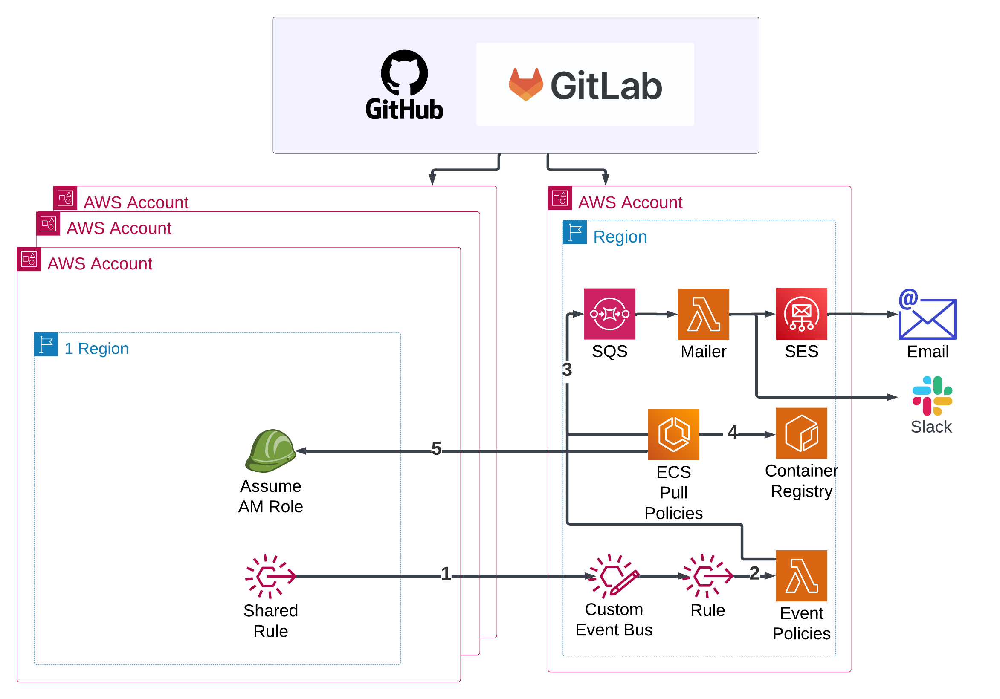
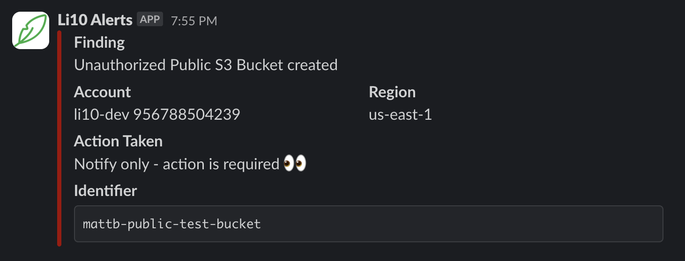

<center>
    <picture>
        <source media="(prefers-color-scheme: dark)" srcset="./docs/img/li10-logo-dark-bg.svg">
        <source media="(prefers-color-scheme: light)" srcset="./docs/img/li10-logo-light-bg.svg">
        
    </picture>

This repository is supported by Li10.
</br>
Check out <a href="https://www.li10.com">www.li10.com</a> to learn more about our private repository and SaaS options.
</center>

</br>

# Li10 Governance
<b>Li10 Governance</b> is an advanced cloud governance solution designed for enterprises seeking real-time compliance and auditing capabilities for cloud infrastructure. Our solution can be deployed quickly (as a SaaS or self-hosted), following industry best-practices, and delivers immediate benefits such as cost reduction, heightened security, and a reduced environmental footprint. <b>Li10 Governance</b> occupies a unique position in the market, balancing flexibility, ease of operation, and cost-effectiveness.

Built upon the robust open source project <a href="https://github.com/cloud-custodian/cloud-custodian">Cloud Custodian</a>, <b>Li10 Governance</b> utilizes its versatile policy-as-code engine to automate:
* the audit of the infrastructure in your AWS environment
* the remediation of non-compliant resources

In addition, <b>Li10 Governance</b> provides:
* a suite of field-tested policies
* infrastructure-as-code and pipelines allowing for predictable, auditable and customizable deployment of <b>Li10 Governance</b>
* a centralized processing for AWS EventBridge Events
* defined least privilege AWS permissions to run <b>Li10 Governance</b>
* a well-formatted notification template

You can find more details about how this solution compares with others on our <a href="https://li10.com/#li10-governance">website</a>.

# Architecture
The following diagram shows the infrastructure of <b>Li10 Governance</b> which can be deployed in your AWS environment.



1. Events from remote AWS accounts are forwarded to a central EventBridge Event Bus
2. Events are fed to a central Lambda function for audit and remediation according to your governance policies
3. Notifications are send to an SQS queue. They can be sent to an email or Slack.
4. ECS (Elastic Container Service) pulls a container image with your policies
5. an ECS Fargate Task is triggered daily and assumes an IAM Role in each account to be audited and remediated.

# CloudFormation Stacks
The infrastructure-as-code deploys 3 stacks:
1. A central stack for audit and remediation
2. A stack for the notification processing
3. A stack for the deployment of necessary IAM Roles and EventBridge Rules in remote accounts

# Repo structure
```
.github/    Contains the GitHub Actions used to deploy this solution
.gitlab/    Contains the GitLab Jobs used to deploy this solution
infra/      Contains the AWS CDK code
├─ cloudcustodian/
│  ├─ cloudcustodian/
│  │  ├─ cloudcustodian_stack.py        Central stack containing the Lambda
│  │  ├─ cloudcustodian_mailer.py       Stack for the Cloud Custodian Mailer deployed along the main stack
│  │  ├─ cloudcustodian_sub_stack.py    Sub stack deployed in all accounts and regions
│  │  ├─ common.py                      Shared configuration
|  ├─ docker/               Dockerfile used to generate the image deployed to ECS
│  ├─ lambda-code/          contains the code to customize the Cloud Custodian Lambda for Event mode policies
│  ├─ lambda-mailer-code/   contains the code to customize the Cloud Custodian Mailer Lambda
│  ├─ transform.py      combine multiple policies into one to eliminate infrastructure duplication
│  ├─ app.py            CDK app where we control which account and regions are monitored
policies/               Cloud Custodian policies to deploy
├─ event-based/         Event mode policies processed in Lambda
├─ scheduled-based/     Pull mode policies trigered by an EventBridge Schedule and running in an ECS Task
├─ templates/           Email and Slack messages templates
```

# Setup
1/ Each region monitored by this solution must have CloudTrail enabled. This is required by event-mode policies such as automated tagging.

2/ Each region monitored by this solution must be CDK-bootstrapped with the command `cdk bootstrap aws://<account id>/<region> --profile <profile-name>`

3/ Each CDK IAM Roles (per region bootstrapped) must have their trust policy configured to trust the role used by the pipeline to deploy the infrastructure.
For example, the IAM Role `arn:aws:iam::111122223333:role/cdk-hnb659fds-cfn-exec-role-111122223333-us-east-1` should be configured to trust `arn:aws:iam::555566667777:role/gh-actions-ssvc-governance`. So the trust policy looks like this
```
{
    "Version": "2012-10-17",
    "Statement": [
        {
            "Effect": "Allow",
            "Principal": {
                "Service": "cloudformation.amazonaws.com",
                "AWS": "arn:aws:iam::555566667777:role/gh-actions-ssvc-governance"
            },
            "Action": "sts:AssumeRole"
        }
    ]
}
```

4/ The AWS Accounts and Regions to monitor should be added to the variable `subStackTargets` in `governance\infra\cloudcustodian\cloudcustodian\common.py` as in the example below.

```
subStackTargets = {
    "555566667777" : ["us-east-1", "us-west-2"],
    "999988887777" : ["us-east-1", "us-west-2"],
    "111122223333" : ["us-east-1", "us-west-2"],
}
```

5/ Push your code to the `main` branch to trigger the pipeline and deploy the infrastructure in the relevant accounts.

6/ The pipeline creates an empty secret in Secrets Manager. To send Slack notifications, create a key `MAILER_SLACK_TOKEN` and set the value to a token, eg: `xoxb-359...`

7/ Update the following settings in `governance\infra\cloudcustodian\transform.py`:
1. `NOTIFY_EMAIL` with the email used to send notifications
2. `NOTIFY_SLACK` with the name of the slack channel where to send notifications
3. `INSTANT_SQS_QUEUE` with the SQS URL of the queue deployed

8/ By default, under `./policies` there are 2 directories: `all` and `staging`. Each of these folders must contain an `accounts.yml` file which contains the details about the AWS accounts and Regions to be audited and remediated. You can add more folders to target specific policies to a different group of accounts and regions.

In addition to `NOTIFY_EMAIL`, `NOTIFY_SLACK` and `INSTANT_SQS_QUEUE`, `role` need to be configured with the role arn of the role created by the IaC. It has this format: `arn:aws:iam::555566667777:role/governance_security_level_1_role`

9/ To receive Slack notifications, you can install the <a href="https://slack.com/apps/A05H2QB0TV1-li10-alerts?tab=more_info">Li10 Alerts</a> Slack app in a channel in your Slack Workspace.



# Policies
The following policies are available by default. You can customize them and add your own.

<table>
<tr>
<th scope="col">Policy File</th>
<th scope="col">Runs In</th>
<th scope="col">Description</th>
</tr>

<tr>
<td>sg_ingress.yml</td>
<td>Lambda</td>
<td>Remediate unauthorized Security Groups</td>
</tr>

<tr>
<td>tagging.yml</td>
<td>Lambda</td>
<td>Auto-tag EC2 and Sagemaker resources</td>
</tr>

<tr>
<td>acm-certificate-audit.yml</td>
<td>ECS</td>
<td>Notify if ACM certificates are expiring soon</td>
</tr>

<tr>
<td>ebs-copy-tags.yml</td>
<td>ECS</td>
<td>Copy EC2 tags to EBS volules and snapshots</td>
</tr>

<tr>
<td>ec2-public-instance-audit.yml</td>
<td>ECS</td>
<td>Report public-facing EC2 instances</td>
</tr>

<tr>
<td>ec2_unused_eip.yml</td>
<td>ECS</td>
<td>Removes unused Elastic IPs</td>
</tr>

<tr>
<td>rds-deprecated.yml</td>
<td>ECS</td>
<td>Motify when an RDS cluster uses a deprecated engine</td>
</tr>

<tr>
<td>rds-unused-30-days.yml</td>
<td>ECS</td>
<td>Remediate unused RDS clusters</td>
</tr>

<tr>
<td>s3-public-access-audit.yml</td>
<td>ECS</td>
<td>Notify if a public S3 bucket is found</td>
</tr>

<tr>
<td>service-quota.yml</td>
<td>ECS</td>
<td>Automate service quota increase request</td>
</tr>

<tr>
<td>sg-remove-ingress-rule.yml</td>
<td>ECS</td>
<td>Remediate non-compliant Security Groups</td>
</tr>

</table>

# How To
## Add a policy
To add or update a policy, we recommend creating a policy file in `./policies/staging/` where it can be executed against a test account. Once the policy is ready, you can move it a different folder where will be applied to more AWS accounts.

## Test locally

To test a policy locally, you can run this command (after replacing the variables with the expected values in the policy file):
```custodian run --profile profile-name iam-policy-has-all.yml -s out --verbose --cache-period 0 --region us-east-1```

## Launch ECS Task using the AWS CLI
```
aws ecs run-task \
    --region us-east-1 \
    --cluster CloudcustodianStack-FargateCPCluster668E71F2-nSqu5xLMqiqa \
    --task-definition CloudcustodianStackecstdCF984091:2 \
    --profile profile-name \
    --network-configuration 'awsvpcConfiguration={subnets=["subnet-0938213728b33a3e6","subnet-0f4184e56927a53b1"],assignPublicIp="DISABLED"}' \
    --launch-type="FARGATE"
```

To run a single policy, add the following with the name of the policy to execute. Others will be ignore:
```
--overrides '{ "containerOverrides": [ { "name": "td-container", "environment": [ { "name": "POLICY_FILTER", "value": "ec2_unused_eip.yml" } ] } ] }'
```
